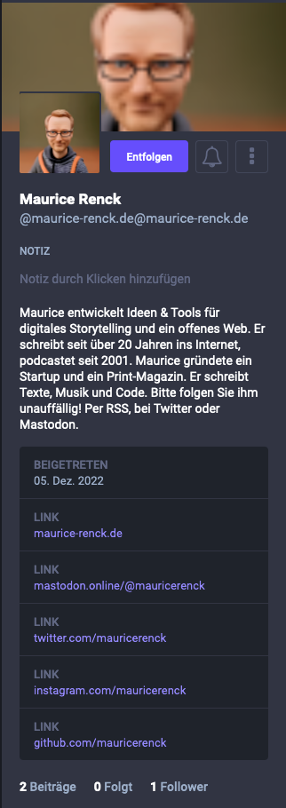

# ActivityPub (beta)

IndieConnector can act as a Mastodon Instance. Once enabled, users can follow your site on a ActivityPub supporting instance, for example on Mastodon or Pixelfed. *Currently this is done by using a free open source third party service for that.* 

## Prequisits 

In order to be able to use this functionality, you have to provide two things, this plugin cannot do:

1. A valid Atom feed
2. microformats

You'll need a least an h-card on your site. This is used to identify you and to show your name or avatar. The most simple variant is this: 

```<a href="https://YOUR-DOMAIN.tld/" class="h-card" rel="me">Your Name</a>```

You can add a lot more information if you want to. [Have a read here](https://microformats.org/wiki/h-card).

## Limitations

1. Make sure sending webmentions is enabled (this is by default)
2. IndieConnector needs to set routes for `.well-known/webfinger` and `.well-known/host-meta*`. If you already use this files you might not want to use this feature.
3. At the moment replies on mastodon won't be sent back to you. As far as I figured out, this is due to some behavior of webmention.io. I am looking for a workaround, which might be not using webmention.io at all. This will take some time.

## Setup

### Plugin

IndieConnector currently uses [brid.gy](https://fed.brid.gy/) to provide this functionality. 

Go to [brid.gy](https://fed.brid.gy/) and select the option "**Connect directly to the fediverse**".
Enter your website url and brid.gy will peform some tests. It should prompt you to add .well-known redirects. To do so, enable activityPub in your Kirby `config.php`

```
'mauricerenck.indieConnector.activityPubBridge' => true
```

After setting this, go to brid.gy and click on check now. This should now work and the prompt should disappear. 

### Template

In your template add this snippet `<?php snippet('activitypub-wm'); ?>`. This will add the nessesary markup to your template. The best way to do so, is to add it into your post content within a `.h-entry` microformat. 

## Publishing posts

Publishing works via webmentions. IndieConnector does this for you already. Once you enable the activityPub feature, this plugin will automatically send an additional webmention to brid.gy. The default rules (like restrictions by template) are applied. So please check those.

Please also make sure to use microformats on your site, so the content can be parsed and more than a title is shown. For example:

```
Regarding <a class="u-in-reply-to" href="https://mastodon.online/@maurice-renck.de@maurice-renck.de/109463377498963385">this post</a>:
<p class="e-content">This a reply to a mastodon post, it'll appear under the original post</p>
```

This way you can [post](https://indieweb.org/post), [reply](https://indieweb.org/reply), [like](https://indieweb.org/like), [repost](https://indieweb.org/repost) other posts or even [follow](https://indieweb.org/follow) users.  

## A more detailed h-card example

Here is a more detailed example of how your h-card could look. This is from my site and I stripped away some stuff used by my UI framework.

```html 
<div class="h-card>
    
    <a class="p-name u-url uk-link-reset" href="https://maurice-renck.de">Maurice Renck</a>
    <ul>
        <li><a href="https://mastodon.online/@mauricerenck"  class="u-url" rel="me" title="mastodon" uk-tooltip="title: Mastodon @mauricerenck@mastodon.online"><span uk-icon="world"></span></a></li>
        <li><a href="https://twitter.com/mauricerenck"  class="u-url" rel="me" title="twitter" uk-tooltip="title: Twitter @mauricerenck"><span uk-icon="twitter"></span></a></li>
        <li><a href="https://instagram.com/mauricerenck"  class="u-url" rel="me" title="instagram" uk-tooltip="title: Instagram @mauricerenck"><span uk-icon="instagram"></span></a></li>
        <li><a href="https://github.com/mauricerenck"  class="u-url" rel="me" title="github" uk-tooltip="title: GitHub @mauricerenck"><span uk-icon="github"></span></a></li>
    </ul>
    <div class="p-note"><p>Maurice entwickelt Ideen &amp; Tools für digitales Storytelling und ein offenes Web. Er schreibt seit über 20 Jahren ins Internet, podcastet seit 2001. Maurice gründete ein Startup und ein Print-Magazin. Er schreibt Texte, Musik und Code.</p>
</div>
```

This will result in this:


